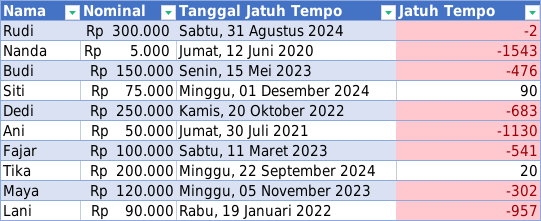

# Materi Excel

## Jatuh Tempo

### Cara Mengerjakan

1. Untuk kolom Nominal, setelah diblok, pencet Ctrl 1
2. Kemudian pilih Accounting
3. Untuk Symbolnya, pilih Rp
4. Untuk Tanggal Jatuh Tempo, format penulisan: 2024-08-31
5. Kemudian, blok, pencet Ctrl 1
6. Masukkan di bagian Custom: [$-id-ID]dddd", "dd mmmm yyyy
7. Untuk jatuh tempo, rumusnya adalah: =DAYS(C2,TODAY())
8. Kemudian, pilih Conditional Formatting
9. Pilih Highlight Cells Rules
10. Pilih Less Than
11. Ketik: 0

## Nama Tengah
