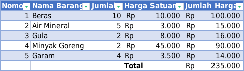

# Materi Excel

## Jatuh Tempo

### Cara Mengerjakan

1. Untuk kolom Nominal, setelah diblok, pencet Ctrl 1
2. Kemudian pilih Accounting
3. Untuk Symbolnya, pilih Rp
4. Untuk Tanggal Jatuh Tempo, format penulisan: 2024-08-31
5. Kemudian, blok, pencet Ctrl 1
6. Masukkan di bagian Custom: [$-id-ID]dddd", "dd mmmm yyyy
7. Untuk jatuh tempo, rumusnya adalah: =DAYS(C2,TODAY())
8. Kemudian, pilih Conditional Formatting
9. Pilih Highlight Cells Rules
10. Pilih Less Than
11. Ketik: 0

## Nama Tengah

### Cara Mengerjakan:

1. Untuk kolom Nama Tengah, ketik Satria aja
2. Lalu di bawahnya, tekan Ctrl e

## Tempat Tanggal Lahir

### Cara Mengerjakan

1. Untuk Tanggal Lahir, format penulisan: 2024-08-31
2. Kemudian, blok, pencet Ctrl 1
3. Masukkan di bagian Custom: [$-id-ID]dddd", "dd mmmm yyyy
4. Untuk Tempat Tanggal Lahir, ketik yang baris pertama aja
5. Di baris kedua, pencet Ctrl e

## Ranking

### Cara Mengerjakan

1. Rumusnya adalah: =RANK(B2,$B$2:$B$6,0)

## Belanja

### Cara Mengerjakan

1. Untuk kolom Banyaknya, cukup ketik angkanya aja. Misal, 10
2. Blok isi dari kolom Banyaknya
3. Pencet Ctrl 1
4. Isi di Custom: General "biji"

## Memisahkan Judul Film

### Cara Mengerjakan

1. Untuk kolom kedua dan ketiga, cukup ketik baris pertamanya aja (Mengenang dan 2014)
2. Kemudian, di bawahnya Mengenang, tekan Ctrl e
3. Di bawahnya 2014, tekan Ctrl e

## Gabung Nama

### Cara Mengerjakan

1. Di kolom Nama Lengkap, ketik yang baris pertama aja
2. Di baris kedua, pencet Ctrl e

## Hari

### Cara Mengerjakan

1. Di kolom Tanggal, format penulisan adalah 2020-12-31
2. Blok, pencet Ctrl 1
3. Pilih yang format Date
4. Untuk kolom Hari, rumusnya adalah: =TEXT(A2,"dddd")

## Penjumlahan

### Cara Mengerjakan

1. Untuk kolom Nomor, di baris kedua, rumusnya adalah: =A2+1
2. Untuk Harga Satuan, pakai format Accounting
3. Untuk Jumlah Harga, formatnya sama
4. Untuk Jumlah Harga, rumusnya adalah: =C2\*D2
5. Yang Total, jangan diisi dulu
6. Blok E2 sampai E6
7. Pencet Alt =

## Textjoin

### Cara Mengerjakan

Rumusnya adalah: =TEXTJOIN("-",TRUE,B2:D2)

## Pivot Table

### Cara Mengerjakan

1. Blok tablenya
2. Klik Insert, pilih Pivot Table
3. Klik Ok
4. Seret Bulan ke Columns
5. Seret Jenis Barang ke Rows
6. Seret Keuntungan ke Values

## Vlookup

`=VLOOKUP(F2;$A$1:$C$11;2;FALSE)`

## Laporan Penjualan

## Umur

`=DATEDIF(B2;TODAY();"y")&" tahun"`
